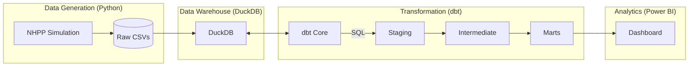

# Vantage Alpin: Analytics Re-Engineering

> **Status:** Production Ready
> **Owner:** Analytics Engineering Portfolio
> **Stack:** Python, DuckDB, dbt, Power BI

## 1. Executive Summary
This project acts as the "Single Source of Truth" for Vantage Alpin's financial reporting. It replaces legacy PDF reports with a dynamic Modern Data Stack (MDS).
The pipeline simulates a realistic e-commerce environment (Data Science Layer), transforms raw stochastic data into a clean Star Schema (Analytics Engineering Layer), and serves it via a robust dimensional model (BI Layer).

## 2. Architecture



## 3. Key Technical Features

### A. Stochastic Data Simulation (`/data_generation`)
We do not use standard "Faker" data. We use a **Non-Homogeneous Poisson Process (NHPP)** to generate order headers.
- **Seasonality:** Weekly (Weekend peaks), Monthly (Payday peaks), and Yearly (Black Friday/Xmas).
- **Affinity:** Product selection uses Pareto-weighted sampling to ensure "Bestsellers" behave realistically.

### B. The Transformation Layer (`/dbt_project`)
We follow a strict **Kimball** methodology.
- **`int_marketing_allocated`**: The crown jewel of this pipeline. It takes Daily Aggregated Marketing Spend from the ad platforms and allocates it down to the **Order Line Level** based on daily revenue share. This enables "Contribution Margin 2" analysis per product.
- **Currency Normalization**: All CHF (Swiss) transactions are converted to EUR using daily exchange rates in `int_orders_standardized`.

### C. Quality Assurance
- **Allocation Test**: `tests/assert_marketing_fully_allocated.sql` guarantees that not a single Euro of marketing spend is lost during allocation (Tolerance: < €5.00/year).

## 4. How to Run

1. **Install Dependencies:**
   ```bash
   pip install -r requirements.txt
   ```

2. **Generate Data:**
   ```bash
   cd data_generation/src
   python3 main.py
   python3 load_duckdb.py
   ```

3. **Build Pipeline:**
   ```bash
   cd ../../dbt_project
   dbt deps
   dbt build
   ```

## 5. Visual Guide (Power BI)
*See `viz/vantage_theme.json` for the Design System.*
- **Color Palette:** Alpine Spruce (Profit), Rescue Orange (Loss), Slate (Volume).
- **Typography:** DIN Pro (Technical) & Inter (UI).
