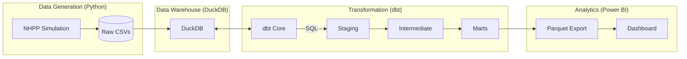
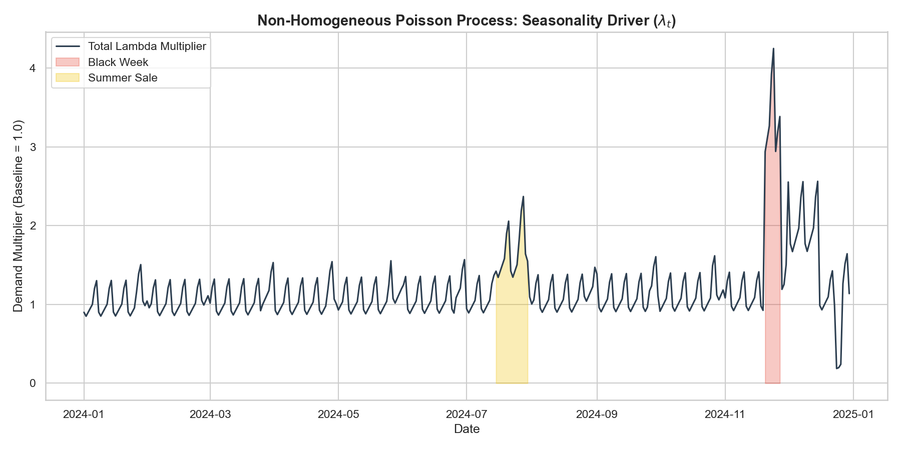
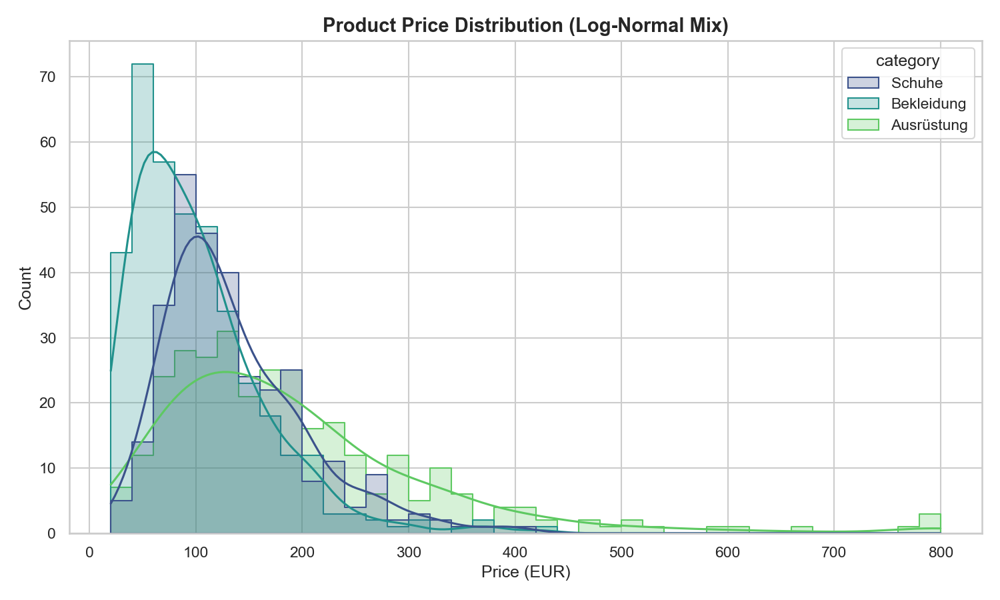
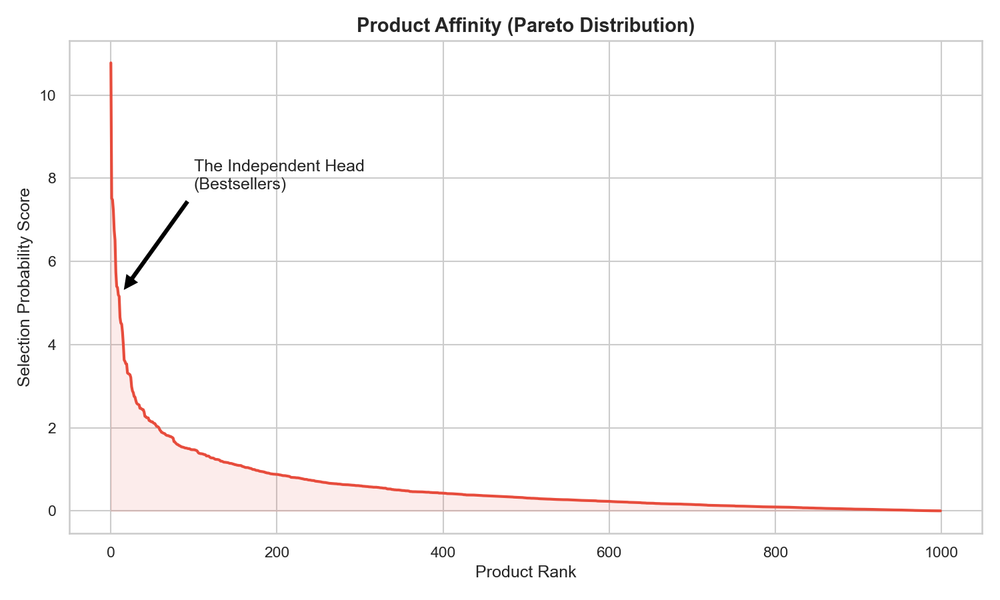

# Vantage Alpin: Analytics Re-Engineering

> **Status:** Production Ready
> **Owner:** Analytics Engineering Portfolio
> **Stack:** Python, DuckDB, dbt, Power BI

## 1. Executive Summary
This project acts as the "Single Source of Truth" for Vantage Alpin's financial reporting. It replaces legacy PDF reports with a dynamic Modern Data Stack (MDS).
The pipeline simulates a realistic e-commerce environment (Data Science Layer), transforms raw stochastic data into a clean Star Schema (Analytics Engineering Layer), and serves it via a robust dimensional model (BI Layer).

## 2. Architecture



## 3. Data Science: Controlled Stochasticity
We generate realistic transaction data using statistical modeling rather than simple random sampling. This ensures the data exhibits the complex patterns found in real e-commerce businesses.

### A. Temporal Dynamics (The "When")
We use a **Non-Homogeneous Poisson Process (NHPP)** to model customer demand. The daily order volume $\lambda_t$ is driven by a composite function:
$$ \lambda_t = \text{Trend}(t) \times \text{Season}_{week}(t) \times \text{Season}_{month}(t) \times \text{Events}(t) $$

*   **Trend:** 10% YoY organic growth.
*   **Weekly:** Weekend peaks (Sunday multiplier: 1.3x).
*   **Monthly:** "Payday Effect" (End-of-month spike).
*   **Events:** Black Week (3.0x), Summer Sale (1.5x), Christmas Rush (1.8x).


*(Figure 1: The generated demand curve showing the interaction of seasonal components)*

### B. Product Economics (The "What")
*   **Pricing:** Follows a **Log-Normal Distribution** ($\mu=4.5, \sigma=0.6$), creating a realistic spread of low-value items and occasional high-value equipment.
*   **Affinity:** Product popularity follows a **Pareto Distribution (Power Law)**. Roughly 20% of the SKUs drive 80% of the volume ("Bestsellers"), while the "Long Tail" caters to niche needs.

<div style="display: flex; gap: 10px;">
  
  
</div>

## 4. Analytics Engineering: The Logic Layer (`/dbt_project`)
We follow a strict **Kimball** dimensional modeling methodology.

### A. Key Transformations
*   **Marketing Allocation (`int_marketing_allocated`)**: 
    *   **Problem:** Marketing spend is aggregated daily (Facebook/Google Ads), but we need to analyze profitability at the *Product* level ("Contribution Margin 2").
    *   **Solution:** We allocate daily spend down to each *Order Line Item* based on its contribution to that day's revenue Share.
    *   *Constraint:* `tests/assert_marketing_fully_allocated` ensures strict zero-sum allocation (< €5.00 variance/year).
    
*   **Currency Normalization (`int_orders_standardized`)**: 
    *   Transactions occur in **EUR** (DE/AT) and **CHF** (Swiss).
    *   We carry `unit_price_local` and `unit_price_eur`, converting CHF to EUR using a daily exchange rate look-up table.

### B. The Marts (Star Schema)
*   **`fct_transactions`**: The central fact table at the **Line Item Grain**. Contains all revenue, COGS, allocated logistics costs, and allocated marketing costs.
*   **`dim_products`**: Type 1 SCD (Slowly Changing Dimension) for product attributes.
*   **`fct_budget_daily`**: Monthly budget targets fanned out to daily grain for "Pacing" charts in BI.

## 5. Business Intelligence & Consumption
### Data Export Pattern
DuckDB is an embedded database. In many local Power BI environments, an ODBC driver is not available or difficult to configure. 
To bypass this, we implemented a **Parquet Export Workflow**:
1.  **Extract:** Review `src/export_bi_tables.py`.
2.  **Transform:** `COPY (SELECT * FROM mart) TO 'file.parquet'`. (Script also produces `.csv`).
3.  **Load:** Power BI reads the folder of Parquet or CSV files directly. 

> **Note:** In a production cloud environment (e.g., Snowflake/BigQuery), Power BI would connect directly via DirectQuery or Import Mode.

## 6. How to Run (Quick Start)

### Prerequisites
- Python 3.10+ installed.

### Step 1: Terminal & Virtual Environment
It is highly recommended to use a virtual environment.

**MacOS / Linux:**
```bash
# 1. Navigate to project root
cd "/path/to/BI Pipeline/vantage-rebuild"

# 2. Create and activate venv
python3 -m venv .venv
source .venv/bin/activate

# 3. Install dependencies
pip install -r requirements.txt
```

**Windows (PowerShell):**
```powershell
# 1. Navigate to project root
cd "C:\path\to\BI Pipeline\vantage-rebuild"

# 2. Create and activate venv
python -m venv .venv
.\.venv\Scripts\Activate.ps1

# 3. Install dependencies
pip install -r requirements.txt
```

### Step 2: Execution
Once your environment is active (you should see `(.venv)` in your terminal prompt), run the pipeline:

1.  **Generate Data & Viz:**
    ```bash
    cd data_generation/src
    python main.py
    python load_duckdb.py
    # Generate Plots
    cd ../..
    python viz/generate_plots.py
    ```

2.  **Build dbt Pipeline:**
    ```bash
    cd dbt_project
    dbt deps
    dbt build
    ```

3.  **Export for BI:**
    ```bash
    # From project root
    python src/export_bi_tables.py
    ```

## 7. Visual Guide (Power BI)
*See `vantage-rebuild/viz/vantage_theme.json` for the Design System.*
- **Color Palette:** Alpine Spruce (Profit), Rescue Orange (Loss), Slate (Volume).
- **Typography:** DIN Pro (Technical) & Inter (UI).
