# Vantage Alpin: Analytics Engineering


<br>

### 📺 Watch the Video Walkthrough

Prefer a visual overview? Check out the **[project walkthrough on YouTube](https://www.youtube.com/watch?v=QGwda9UsQHg)** for a comprehensive look at the pipeline, data architecture, and the final dashboard.

<div align="center">
  <a href="https://www.youtube.com/watch?v=QGwda9UsQHg">
    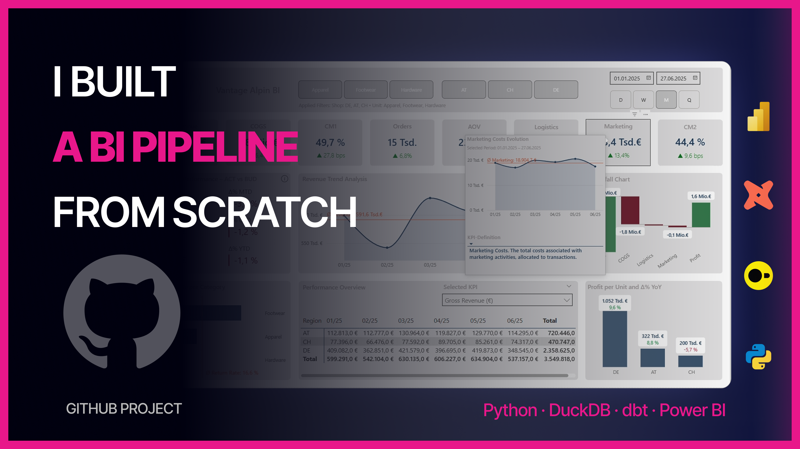
  </a>
</div>

<br>

## 1. Project Overview
This project acts as the "Single Source of Truth" for Vantage Alpin's financial reporting. It replaces legacy PDF reports with a dynamic Modern Data Stack (MDS). By simulating a realistic e-commerce environment, transforming raw stochastic data into a clean Star Schema, and serving it via a robust dimensional model, it delivers a highly scalable and interactive Business Intelligence experience.

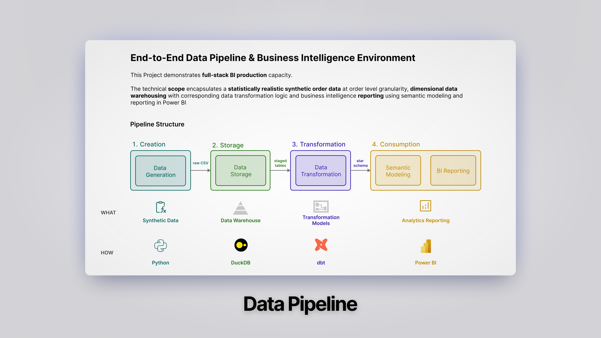

The pipeline handles the end-to-end process from stochastically simulated data to dimensional data warehousing and BI reporting, consisting of four main phases:

(1) Synthetic Data generation in Python 
(2) Data Storage and Warehousing using DuckDB 
(3) Data Transformations using dbt and 
(4) Reporting using Power BI.

## 2. Business Intelligence (Power BI)

### Dashboard Overview
The core of this project is the top-level analytical dashboard, designed to answer key business questions at a glance and provide a progressive disclosure of detailed data.

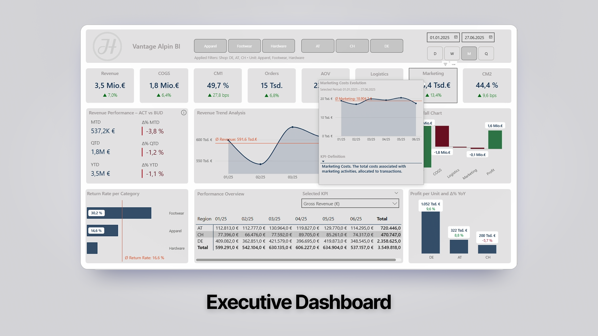

This project is a high level reporting use case for strategic insights. The dashboard is a part of a typical BI ecosystem, where in a company there are various distinct functional domains with varying requirements.

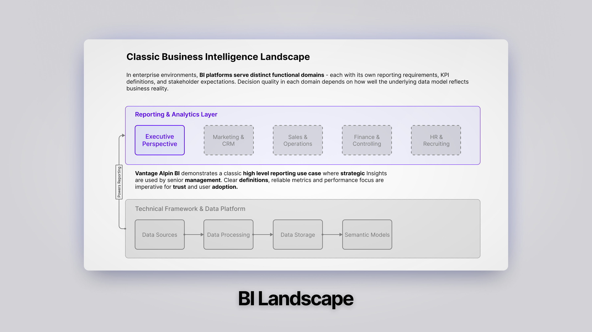

Git Version Control serves as the code management layer that syncs with the Fabric Environment, where different workspaces are being used to develop and version control the data assets, ensuring changes in the semantic model are only valid with a review. Following this workflow, assets are built in the (1) Dev Workspace, promoted to the (2) Test Workspace, and finally deployed into the (3) Prod workspace.

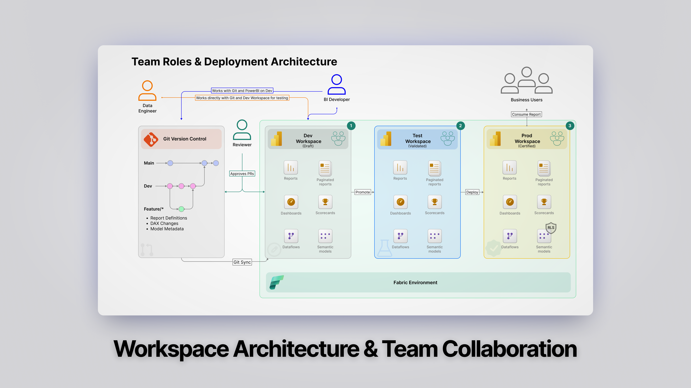

Users consume only the data from the Prod layer, which has been vetted; in that layer, Row-Level Security (RLS) is applied to the semantic model to manage access rights.

### UI / UX / DX
To ensure fast development and maintain clear structures, we utilize a 16px Power BI grid aligned with a classic 4px grid system. This approach provides a solid foundation for optimal spacing and layout, enhancing both the developer experience (DX) and the end-user experience (UX).

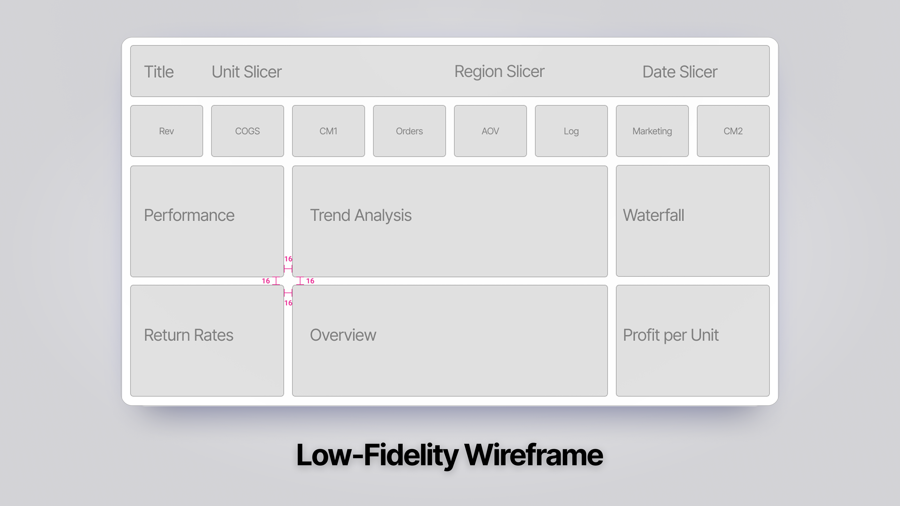

The dashboard is structured so the most important information is always at the top. Slicers sit in the header row to establish context — unit, region, and time period — before the user reads anything else. KPI cards follow immediately beneath, giving headline numbers upfront rather than burying them in charts.
The visual layout guides the eye from top-left to bottom-right naturally, so Performance and Profit per Unit — the two most strategically relevant visuals — land at the beginning and end of that path. The KPI row works left to right by importance, with Revenue and COGS leading and supporting metrics trailing toward the right.

### Data Model
We prioritize maintainability over complexity. The data model follows a strict **Star Schema** with a clear separation of facts and dimensions. We enforce a "No Calculated Columns" policy to ensure optimal compression and performance. For convenience and interactivity, we used a synthetic `dim_date` table that can be accessed [here](https://github.com/julianhilgemann/BI-Pipeline/blob/main/vantage-rebuild/dashboard_pbip/vantage_sales_bi.SemanticModel/definition/tables/synth_dim_date.tmdl).

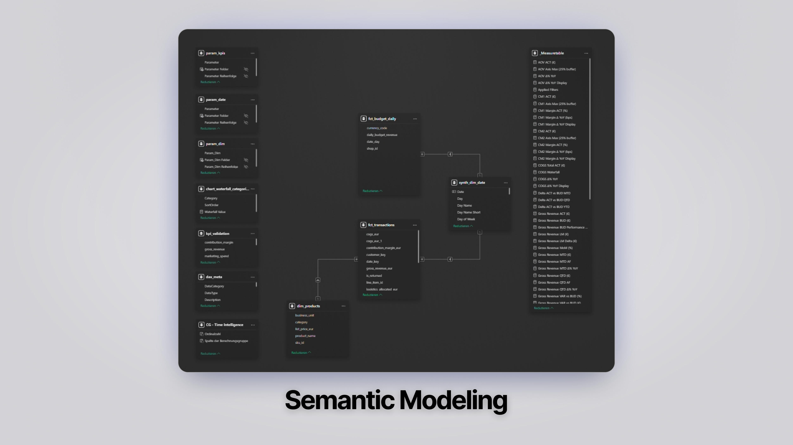

### Semantic Model & Measure Architecture

Our DAX engineering strategy is driven by efficiency and scalability.

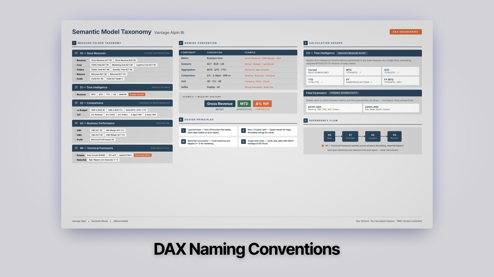

All measures are centralized in a dedicated `_Measuretable` (no physical data) and organized logically into folders and subfolders that reflect a layered calculation dependency chain.

#### Folder Taxonomy

```text
_Measuretable/
├── 00 - Base Measures/          ← Atomic aggregations against fact tables
│   ├── Revenue/                    Gross Revenue ACT (€), Gross Revenue BUD (€)
│   ├── Cost/                       COGS Total ACT (€), Marketing Cost ACT (€), Logistics Cost ACT (€)
│   ├── Orders/                     Orders Total ACT (#), Quantity Total ACT (#)
│   ├── Returns/                    Returned ACT (€), Returned ACT (%)
│   └── Profit/                     Profit ACT (€), Profit ACT MoM %
│
├── 01 - Time Intelligence/      ← Period-to-date and period-over-period
│   └── Revenue/                    MTD, QTD, YTD, LM, MoM (€ and auto-formatted display variants)
│
├── 02 - Comparisons/            ← Variance and benchmarking
│   ├── vs Budget/                  VAR vs BUD (€), VAR vs BUD (%), Delta ACT vs BUD (MTD/QTD/YTD)
│   └── YoY/                        Δ% YoY for Revenue, COGS, Orders, AOV, Logistics, Marketing
│                                    Δ YoY (bps) for CM1 Margin, CM2 Margin
│
├── 03 - Business Performance/   ← Derived P&L metrics
│   ├── CM1/                        CM1 ACT (€), CM1 Margin ACT (%)
│   ├── CM2/                        CM2 ACT (€), CM2 Margin ACT (%)
│   └── Profit/                     Returned Profit Impact (€)
│
└── 99 - Technical Framework/    ← Non-analytical support measures
    ├── Display Formatting/         Auto-formatted strings (K/M/B), YoY arrow displays,
    │                                Applied Filters summary, Selected Period label,
    │                                dynamic axis scaling (25% buffer)
    └── Waterfall Helpers/          Sign-flipped cost measures for waterfall chart rendering
```

#### Naming Convention

Every measure follows a consistent pattern to ensure readability in field lists, DAX expressions, and report tooltips:

| Component | Convention | Example |
|---|---|---|
| **Metric** | Business term | `Gross Revenue`, `CM2 Margin`, `AOV` |
| **Scenario** | `ACT` · `BUD` · `LM` | Actual · Budget · Last Month |
| **Aggregation** | `MTD` · `QTD` · `YTD` | Period-to-date variants |
| **Comparison** | `Δ%` · `Δ (bps)` · `VAR vs` | Relative change · Basis points · Variance |
| **Unit** | `(€)` · `(%)` · `(#)` | Currency · Ratio · Count |
| **Suffix** | `Display` · `AF` | String-formatted for cards · Auto-formatted (K/M/B) |

Example: `Gross Revenue MTD Δ% YoY` → Gross Revenue, Month-to-Date, Year-over-Year percentage change.

#### Design Principles

**Layered dependencies** — Base measures (`00`) are the only layer that touches fact tables via `SUM` / `DISTINCTCOUNT`. Every subsequent folder builds exclusively on measures from prior layers, never re-aggregating raw columns. This makes the calculation chain auditable and simplifies debugging.

**Numeric / display separation** — Analytical measures return typed numeric values for use in conditional formatting, axes, and further calculations. Parallel `Display` measures in `99` return formatted strings with directional arrows (`▲` / `▼`) for KPI cards. The two are never mixed.

**Waterfall sign convention** — Cost measures in `99 - Waterfall Helpers` are pre-multiplied by `-1` so waterfall visuals render correctly without per-visual sign logic.

**All time intelligence uses the synthetic date table** (`synth_dim_date[Date]`) — a custom-built date dimension with German/Austrian/Swiss holiday flags and ISO fiscal periods, ensuring all `DATEADD`, `SAMEPERIODLASTYEAR`, and `TOTALMTD/QTD/YTD` functions operate against a single governed calendar.

The semantic model uses Field Parameters extensively to increase dashboard interactivity without multiplying report pages. param_kpis lets users switch between key metrics — Revenue, Contribution Margin, AOV, and others — through a single slicer, keeping the layout focused while exposing the full breadth of the model. param_date controls time granularity dynamically, allowing the same trend visuals to switch between Day, Week, Month, and Quarter without any filter logic on the report layer. This approach keeps the model's complexity internal while the end user experiences a clean, flexible interface — which is the practical definition of a well-designed semantic layer.

#### Scalability & Metadata

We utilize best practices for measure logic, prioritizing scalability in mind. **Calculation Groups** enable clutter-free and rapid iteration on the existing semantic model, significantly reducing measure bloat and allowing users to seamlessly switch between different dynamic views.

**TMDL** is the de-facto new standard for version-controlled semantic modeling which is useful in a collaborative setting. It enables diff views as well as easy understanding of the model without opening PowerBI. You can explore the main tables and measures accessed through TMDL here:
- [Calculation Groups](https://github.com/julianhilgemann/BI-Pipeline/blob/main/vantage-rebuild/dashboard_pbip/vantage_sales_bi.SemanticModel/definition/tables/CG%20-%20Time%20Intelligence.tmdl)
- [Measuretable](https://github.com/julianhilgemann/BI-Pipeline/blob/main/vantage-rebuild/dashboard_pbip/vantage_sales_bi.SemanticModel/definition/tables/_Measuretable.tmdl)

Metadata is added everywhere so that it is always clear what the measures actually do, what the tables mean, and so on. This clean metadata infrastructure enables a **Model inherent KPI Framework** with an interactive glossary as well as interactive tool-tips and definitions, ensuring the self-documenting semantic layer is completely transparent for any analyst.

## 3. Data Generation: Controlled Stochasticity
We generate realistic transaction data using statistical modeling rather than simple random sampling. This ensures the data exhibits the complex patterns found in real e-commerce businesses.

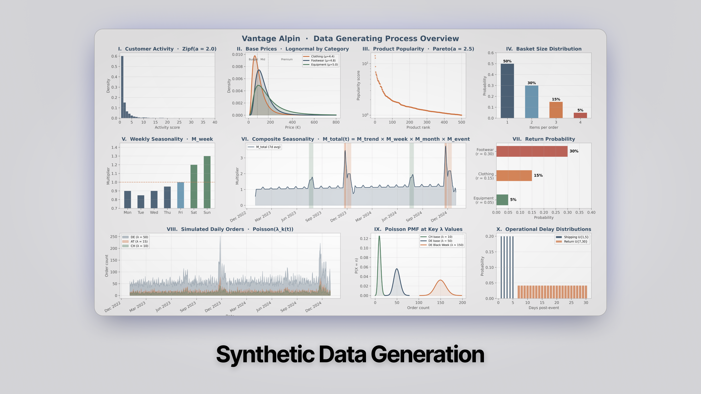

### A. Temporal Dynamics (The "When")
We use a **Non-Homogeneous Poisson Process (NHPP)** to model customer demand. The daily order volume $\lambda_t$ is driven by a composite function:
$$ \lambda_t = \text{Trend}(t) \times \text{Season}_{week}(t) \times \text{Season}_{month}(t) \times \text{Events}(t) $$

*   **Trend:** 10% YoY organic growth.
*   **Weekly:** Weekend peaks (Sunday multiplier: 1.3x).
*   **Monthly:** "Payday Effect" (End-of-month spike).
*   **Events:** Black Week (3.0x), Summer Sale (1.5x), Christmas Rush (1.8x).

### B. Product Economics (The "What")
*   **Pricing:** Follows a **Log-Normal Distribution** ($\mu=4.5, \sigma=0.6$), creating a realistic spread of low-value items and occasional high-value equipment.
*   **Affinity:** Product popularity follows a **Pareto Distribution (Power Law)**. Roughly 20% of the SKUs drive 80% of the volume ("Bestsellers"), while the "Long Tail" caters to niche needs.

## 4. Analytics Engineering: The Logic Layer (`/dbt_project`)
We follow a strict **Kimball** dimensional modeling methodology.

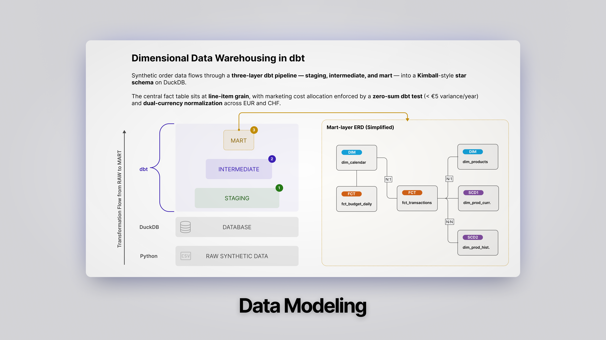

### A. Key Transformations
*   **Marketing Allocation (`int_marketing_allocated`)**: 
    *   **Problem:** Marketing spend is aggregated daily (Facebook/Google Ads), but we need to analyze profitability at the *Product* level ("Contribution Margin 2").
    *   **Solution:** We allocate daily spend down to each *Order Line Item* based on its contribution to that day's revenue Share.
    *   *Constraint:* `tests/assert_marketing_fully_allocated` ensures strict zero-sum allocation (< €5.00 variance/year).
    
*   **Currency Normalization (`int_orders_standardized`)**: 
    *   Transactions occur in **EUR** (DE/AT) and **CHF** (Swiss).
    *   We carry `unit_price_local` and `unit_price_eur`, converting CHF to EUR using a daily exchange rate look-up table.

### B. The Marts (Star Schema)
*   **`fct_transactions`**: The central fact table at the **Line Item Grain**. Contains all revenue, COGS, allocated logistics costs, and allocated marketing costs.
*   **`dim_products`**: Type 1 SCD (Slowly Changing Dimension) for product attributes.
*   **`fct_budget_daily`**: Monthly budget targets fanned out to daily grain for "Pacing" charts in BI.

### C. Lineage Tracking

To ensure transparency and maintainability, the data flow from raw sources to the final marts is continuously modeled and tracked. The diagram below illustrates the complete dbt lineage, showcasing how source data is staged, how intermediate transformations handle business logic (like currency conversion and cost allocation), and how everything culminates in the final fact and dimension tables.

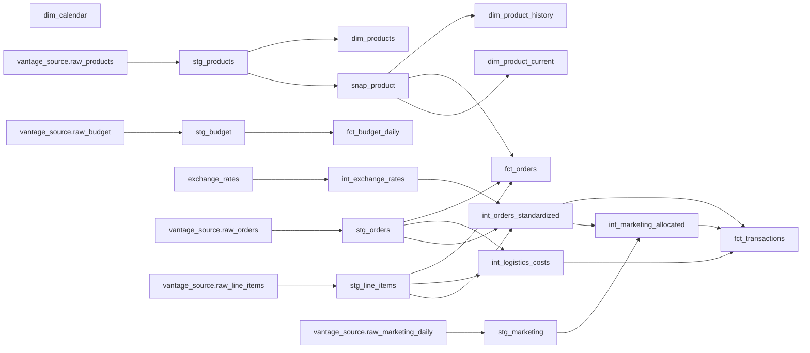
```mermaid
flowchart LR
    model_vantage_rebuild_stg_products["stg_products"]
    model_vantage_rebuild_stg_line_items["stg_line_items"]
    model_vantage_rebuild_stg_marketing["stg_marketing"]
    model_vantage_rebuild_stg_orders["stg_orders"]
    model_vantage_rebuild_stg_budget["stg_budget"]
    model_vantage_rebuild_dim_calendar["dim_calendar"]
    model_vantage_rebuild_dim_products["dim_products"]
    model_vantage_rebuild_dim_product_history["dim_product_history"]
    model_vantage_rebuild_fct_orders["fct_orders"]
    model_vantage_rebuild_dim_product_current["dim_product_current"]
    model_vantage_rebuild_fct_budget_daily["fct_budget_daily"]
    model_vantage_rebuild_fct_transactions["fct_transactions"]
    model_vantage_rebuild_int_logistics_costs["int_logistics_costs"]
    model_vantage_rebuild_int_exchange_rates["int_exchange_rates"]
    model_vantage_rebuild_int_orders_standardized["int_orders_standardized"]
    model_vantage_rebuild_int_marketing_allocated["int_marketing_allocated"]
    snapshot_vantage_rebuild_snap_product["snap_product"]
    seed_vantage_rebuild_exchange_rates["exchange_rates"]
    source_vantage_rebuild_vantage_source_raw_orders["vantage_source.raw_orders"]
    source_vantage_rebuild_vantage_source_raw_line_items["vantage_source.raw_line_items"]
    source_vantage_rebuild_vantage_source_raw_products["vantage_source.raw_products"]
    source_vantage_rebuild_vantage_source_raw_marketing_daily["vantage_source.raw_marketing_daily"]
    source_vantage_rebuild_vantage_source_raw_budget["vantage_source.raw_budget"]
    source_vantage_rebuild_vantage_source_raw_products --> model_vantage_rebuild_stg_products
    source_vantage_rebuild_vantage_source_raw_line_items --> model_vantage_rebuild_stg_line_items
    source_vantage_rebuild_vantage_source_raw_marketing_daily --> model_vantage_rebuild_stg_marketing
    source_vantage_rebuild_vantage_source_raw_orders --> model_vantage_rebuild_stg_orders
    source_vantage_rebuild_vantage_source_raw_budget --> model_vantage_rebuild_stg_budget
    model_vantage_rebuild_stg_products --> model_vantage_rebuild_dim_products
    snapshot_vantage_rebuild_snap_product --> model_vantage_rebuild_dim_product_history
    model_vantage_rebuild_stg_orders --> model_vantage_rebuild_fct_orders
    model_vantage_rebuild_stg_line_items --> model_vantage_rebuild_fct_orders
    snapshot_vantage_rebuild_snap_product --> model_vantage_rebuild_fct_orders
    snapshot_vantage_rebuild_snap_product --> model_vantage_rebuild_dim_product_current
    model_vantage_rebuild_stg_budget --> model_vantage_rebuild_fct_budget_daily
    model_vantage_rebuild_int_marketing_allocated --> model_vantage_rebuild_fct_transactions
    model_vantage_rebuild_int_logistics_costs --> model_vantage_rebuild_fct_transactions
    model_vantage_rebuild_int_orders_standardized --> model_vantage_rebuild_fct_transactions
    model_vantage_rebuild_stg_orders --> model_vantage_rebuild_int_logistics_costs
    model_vantage_rebuild_stg_line_items --> model_vantage_rebuild_int_logistics_costs
    seed_vantage_rebuild_exchange_rates --> model_vantage_rebuild_int_exchange_rates
    model_vantage_rebuild_stg_orders --> model_vantage_rebuild_int_orders_standardized
    model_vantage_rebuild_stg_line_items --> model_vantage_rebuild_int_orders_standardized
    model_vantage_rebuild_int_exchange_rates --> model_vantage_rebuild_int_orders_standardized
    model_vantage_rebuild_int_orders_standardized --> model_vantage_rebuild_int_marketing_allocated
    model_vantage_rebuild_stg_marketing --> model_vantage_rebuild_int_marketing_allocated
    model_vantage_rebuild_stg_products --> snapshot_vantage_rebuild_snap_product
```

## 5. Repo Navigation

If you want to dig deeper into the codebase, here is a high-level orientation of where everything lives and how data flows through the pipeline:

1. **Synthetic Data Generation (`data_generation/`)**: Python scripts simulate e-commerce events and dump the raw outputs as `.csv` files into a local output directory.
2. **Data Warehouse Load (`data/` & `src/`)**: A Python script (`load_duckdb.py`) ingests these raw CSVs into a local DuckDB database (`data/vantage.duckdb`), which serves as our data warehouse.
3. **Data Transformation (`dbt_project/`)**: dbt connects to the DuckDB database. It reads the raw tables and applies SQL transformations:
   - `models/staging`: Basic type casting and renaming.
   - `models/intermediate`: Complex business logic, allocations, and currency normalizations.
   - `models/marts`: Final Star Schema dimension (`dim_*.sql`) and fact (`fct_*.sql`) tables.
4. **Export & Serving (`src/export_bi_tables.py`)**: The final dbt marts are exported back out as optimized Parquet files.
5. **Business Intelligence (`dashboard_pbip/`)**: Power BI connects to these Parquet files. This folder contains the Git-versioned representation of the report and the Semantic Model (`.tmdl` files) utilizing DAX for final aggregations.

*Bonus:* The **`viz/`** folder contains the architecture diagrams and charts utilized in this documentation.

## 6. How to Run (Quick Start)

### Prerequisites
- Python 3.10+ installed.

### Step 1: Terminal & Virtual Environment
It is highly recommended to use a virtual environment.

**MacOS / Linux:**
```bash
# 1. Navigate to project root
cd "/path/to/BI Pipeline/vantage-rebuild"

# 2. Create and activate venv
python3 -m venv .venv
source .venv/bin/activate

# 3. Install dependencies
pip install -r requirements.txt
```

**Windows (PowerShell):**
```powershell
# 1. Navigate to project root
cd "C:\path\to\BI Pipeline\vantage-rebuild"

# 2. Create and activate venv
python -m venv .venv
.\.venv\Scripts\Activate.ps1

# 3. Install dependencies
pip install -r requirements.txt
```

### Step 2: Execution
Once your environment is active (you should see `(.venv)` in your terminal prompt), run the pipeline:

1.  **Generate Data & Viz:**
    ```bash
    cd data_generation/src
    python main.py
    python load_duckdb.py
    # Generate Plots
    cd ../..
    python viz/generate_plots.py
    ```

2.  **Build dbt Pipeline:**
    ```bash
    cd dbt_project
    dbt deps
    dbt build
    ```

3.  **Export for BI:**
    ```bash
    # From project root
    python src/export_bi_tables.py
    ```
