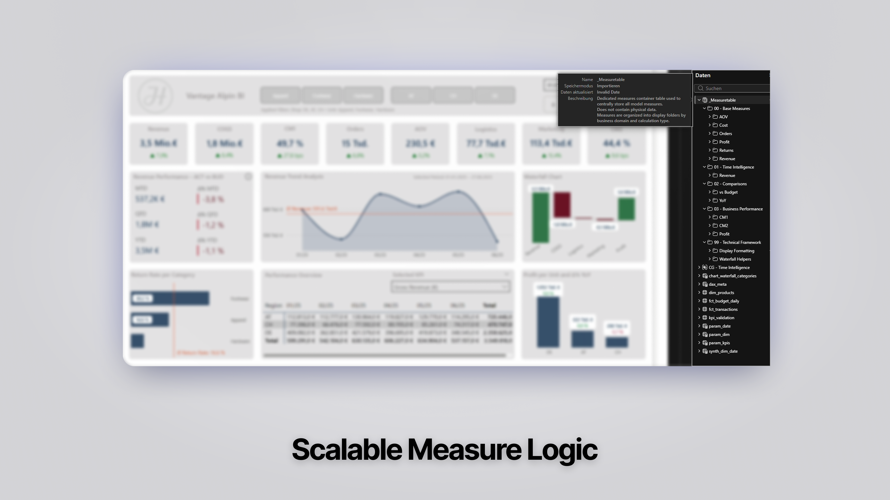
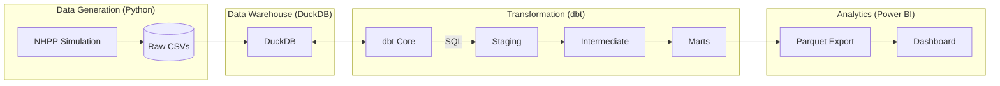
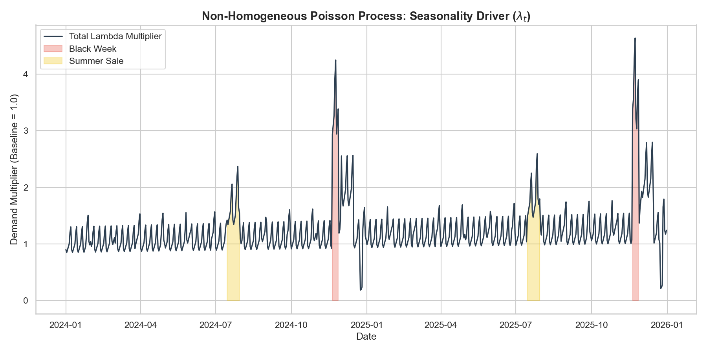
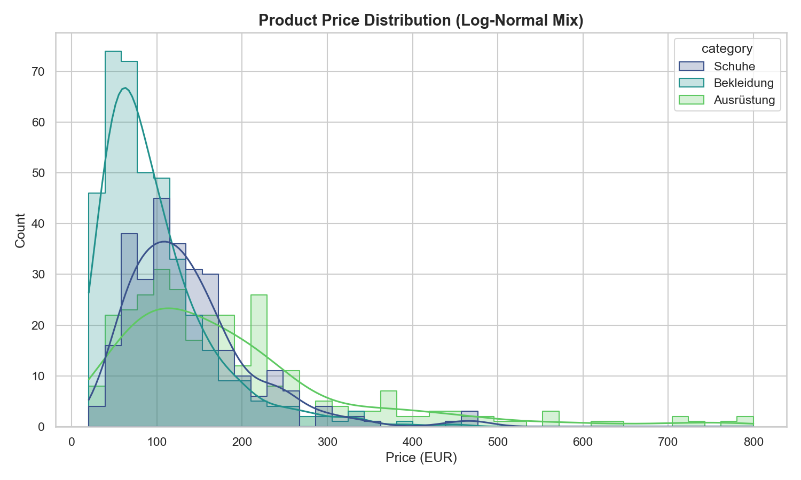
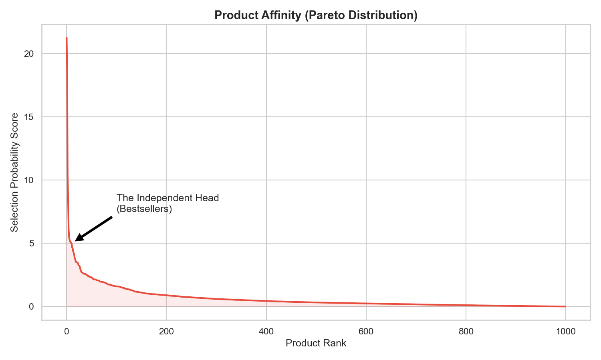

# Vantage Alpin: Analytics Re-Engineering

> **Status:** Production Ready
> **Owner:** Analytics Engineering Portfolio
> **Stack:** Python, DuckDB, dbt, Power BI

## 1. Project Overview
This project acts as the "Single Source of Truth" for Vantage Alpin's financial reporting. It replaces legacy PDF reports with a dynamic Modern Data Stack (MDS). By simulating a realistic e-commerce environment, transforming raw stochastic data into a clean Star Schema, and serving it via a robust dimensional model, it delivers a highly scalable and interactive Business Intelligence experience.

## 2. Business Intelligence (Power BI)

### Dashboard Overview
The core of this project is the top-level analytical dashboard, designed to answer key business questions at a glance and provide a progressive disclosure of detailed data.


### Data Model
We prioritize maintainability over complexity. The data model follows a strict **Star Schema** with a clear separation of facts and dimensions. We enforce a "No Calculated Columns" policy to ensure optimal compression and performance. For convenience and interactivity, we used a synthetic `dim_date` table that can be accessed [here](https://github.com/julianhilgemann/BI-Pipeline/blob/main/vantage-rebuild/dashboard_pbip/vantage_sales_bi.SemanticModel/definition/tables/synth_dim_date.tmdl).


### Measure Logic & Scalability
Our DAX engineering strategy is driven by efficiency and scalability. Measures are organized logically into folders and subfolders for easy navigation. 



We utilize best practices for measure logic, prioritizing scalability in mind. **Calculation Groups** enable clutter-free and rapid iteration on the existing semantic model, significantly reducing measure bloat and allowing users to seamlessly switch between different dynamic views.

**TMDL** is the de-facto new standard for version-controlled semantic modeling which is useful in a collaborative setting. It enables diff views as well as easy understanding of the model without opening PowerBI. You can explore the main tables and measures accessed through TMDL here:
- [Calculation Groups](https://github.com/julianhilgemann/BI-Pipeline/blob/main/vantage-rebuild/dashboard_pbip/vantage_sales_bi.SemanticModel/definition/tables/CG%20-%20Time%20Intelligence.tmdl)
- [Measuretable](https://github.com/julianhilgemann/BI-Pipeline/blob/main/vantage-rebuild/dashboard_pbip/vantage_sales_bi.SemanticModel/definition/tables/_Measuretable.tmdl)

Metadata is added everywhere so that it is always clear what the measures actually do, what the tables mean, and so on. This clean metadata infrastructure enables a **Model inherent KPI Framework** with an interactive glossary as well as interactive tool-tips and definitions, ensuring the self-documenting semantic layer is completely transparent for any analyst.

## 3. Architecture


```mermaid
flowchart LR
    subgraph Gen ["Data Generation (Python)"]
    Py[NHPP Simulation]
    CSV[(Raw CSVs)]
    end
    subgraph WH ["Data Warehouse (DuckDB)"]
    Duck[DuckDB]
    end
    subgraph Trans ["Transformation (dbt)"]
    dbt[dbt Core]
    Stg[Staging]
    Int[Intermediate]
    Mart[Marts]
    end
    subgraph BI ["Analytics (Power BI)"]
    Exp[Parquet Export]
    PBI[Dashboard]
    end
    Py --> CSV
    CSV --> Duck
    Duck <--> dbt
    dbt -- SQL --> Stg
    Stg --> Int
    Int --> Mart
    Mart --> Exp
    Exp --> PBI
```

## 4. Data Generation: Controlled Stochasticity
We generate realistic transaction data using statistical modeling rather than simple random sampling. This ensures the data exhibits the complex patterns found in real e-commerce businesses.

### A. Temporal Dynamics (The "When")
We use a **Non-Homogeneous Poisson Process (NHPP)** to model customer demand. The daily order volume $\lambda_t$ is driven by a composite function:
$$ \lambda_t = \text{Trend}(t) \times \text{Season}_{week}(t) \times \text{Season}_{month}(t) \times \text{Events}(t) $$

*   **Trend:** 10% YoY organic growth.
*   **Weekly:** Weekend peaks (Sunday multiplier: 1.3x).
*   **Monthly:** "Payday Effect" (End-of-month spike).
*   **Events:** Black Week (3.0x), Summer Sale (1.5x), Christmas Rush (1.8x).


*(Figure 1: The generated demand curve showing the interaction of seasonal components)*

### B. Product Economics (The "What")
*   **Pricing:** Follows a **Log-Normal Distribution** ($\mu=4.5, \sigma=0.6$), creating a realistic spread of low-value items and occasional high-value equipment.
*   **Affinity:** Product popularity follows a **Pareto Distribution (Power Law)**. Roughly 20% of the SKUs drive 80% of the volume ("Bestsellers"), while the "Long Tail" caters to niche needs.

<div style="display: flex; gap: 10px;">
  
  
</div>

## 5. Analytics Engineering: The Logic Layer (`/dbt_project`)
We follow a strict **Kimball** dimensional modeling methodology.

### A. Key Transformations
*   **Marketing Allocation (`int_marketing_allocated`)**: 
    *   **Problem:** Marketing spend is aggregated daily (Facebook/Google Ads), but we need to analyze profitability at the *Product* level ("Contribution Margin 2").
    *   **Solution:** We allocate daily spend down to each *Order Line Item* based on its contribution to that day's revenue Share.
    *   *Constraint:* `tests/assert_marketing_fully_allocated` ensures strict zero-sum allocation (< €5.00 variance/year).
    
*   **Currency Normalization (`int_orders_standardized`)**: 
    *   Transactions occur in **EUR** (DE/AT) and **CHF** (Swiss).
    *   We carry `unit_price_local` and `unit_price_eur`, converting CHF to EUR using a daily exchange rate look-up table.

### B. The Marts (Star Schema)
*   **`fct_transactions`**: The central fact table at the **Line Item Grain**. Contains all revenue, COGS, allocated logistics costs, and allocated marketing costs.
*   **`dim_products`**: Type 1 SCD (Slowly Changing Dimension) for product attributes.
*   **`fct_budget_daily`**: Monthly budget targets fanned out to daily grain for "Pacing" charts in BI.

## 6. How to Run (Quick Start)

### Prerequisites
- Python 3.10+ installed.

### Step 1: Terminal & Virtual Environment
It is highly recommended to use a virtual environment.

**MacOS / Linux:**
```bash
# 1. Navigate to project root
cd "/path/to/BI Pipeline/vantage-rebuild"

# 2. Create and activate venv
python3 -m venv .venv
source .venv/bin/activate

# 3. Install dependencies
pip install -r requirements.txt
```

**Windows (PowerShell):**
```powershell
# 1. Navigate to project root
cd "C:\path\to\BI Pipeline\vantage-rebuild"

# 2. Create and activate venv
python -m venv .venv
.\.venv\Scripts\Activate.ps1

# 3. Install dependencies
pip install -r requirements.txt
```

### Step 2: Execution
Once your environment is active (you should see `(.venv)` in your terminal prompt), run the pipeline:

1.  **Generate Data & Viz:**
    ```bash
    cd data_generation/src
    python main.py
    python load_duckdb.py
    # Generate Plots
    cd ../..
    python viz/generate_plots.py
    ```

2.  **Build dbt Pipeline:**
    ```bash
    cd dbt_project
    dbt deps
    dbt build
    ```

3.  **Export for BI:**
    ```bash
    # From project root
    python src/export_bi_tables.py
    ```
