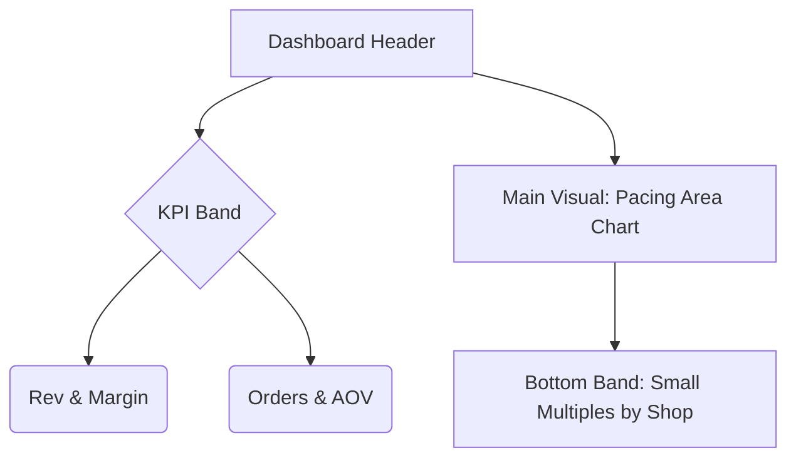

# Dashboard Mockup: Vantage Alpin

**Role:** BI Developer
**References:** 
- `context/DAX_Guidelines.md` (Measure Logic)
- `context/BI Developer.md` (Visual Strategy)

This mockup translates our standardized DAX measures into the proposed "Vantage Look & Feel" dashboard logic.

---

## 1. The "Debug Page" (Hidden)

**Objective:** Validate Power BI measures against dbt "Golden Record" (`mnt_golden_kpi`).

**Visual:** Matrix Table
**Grain:** Month, Shop

```text
+---------------------+-------------------------+-------------------------+-------------------------+
| Month | Shop        | Gross Revenue ACT (€)   | dbt_total_revenue       | Delta (Color Rule)      |
|       |             | [Measure from DAX Guide]| [Column from Database]  | [Measure] - [Column]    |
+-------+-------------+-------------------------+-------------------------+-------------------------+
| Jan   | DE_Shop     | € 150,000.00            | 150,000.00              | 0.00 (GREEN)            |
| Jan   | AT_Shop     | €  45,000.00            |  45,000.00              | 0.00 (GREEN)            |
| Jan   | CH_Shop     | €  80,000.00            |  79,999.00              | 1.00 (RED!)             |
+-------+-------------+-------------------------+-------------------------+-------------------------+
```

> **Process Note:** If "Delta" is not 0, I do not proceed to visual build.

---

## 2. Page 1: Executive Overview

**Layout Strategy:** High-level KPIs followed by trending and shop breakdown.

### Wireframe (Mermaid)



### Detailed Visual Specifics

#### A. KPI Band (Cards + Sparklines)
*Using strict Naming Convention from DAX Guidelines.*

**Card 1: Revenue**
- **Value:** `Gross Revenue ACT (€)`
- **Trend:** `Gross Revenue MoM (%)` (Red/Green icon)
- **Sparkline:** `Gross Revenue ACT (€)` by Date (Last 30 Days rolling)

**Card 2: Profitability**
- **Value:** `CM2 Margin ACT (%)`
- **Subtitle:** `CM2 ACT (€)`
- **Trend:** `CM2 Margin ACT (%)` vs Last Month

#### B. Pacing Chart (Area Chart)
*Visualizing "The Confidence Interval" Logic.*

- **X-Axis:** `dim_calendar[date_key]`
- **Y-Axis:** Currency (€)
- **Line 1 (Solid):** `Gross Revenue ACT (€)` (Actuals to-date)
- **Line 2 (Dotted):** `Gross Revenue BUD (€)` (Target for full period)
- **Title Dynamic:** `Gross Revenue BUD Performance (String)` e.g., "+5.2% vs BUD"

#### C. Shop Performance (Small Multiples)
*Bar Charts splitting the main metric by Store.*

- **Dimension:** `dim_shop[shop_id]`
- **Measure:** `Gross Revenue ACT (€)`
- **Color Logic:** Grey = Base, Green = Top Performer

---

## 3. Page 4: Variance Analysis (CFO View)

**Objective:** Explain *why* we missed the budget.  
*Note: Due to Data Model limitations (Budget only on Revenue), this is purely a Revenue Bridge.*

### Visual: Waterfall Chart

```text
Step 1: Budget Start  | [====================] (Gross Revenue BUD (€))
                      |
Step 2: Volume Effect | [====] (Impact of # Orders difference)
                      |
Step 3: Price Effect  |      [==] (Impact of AOV difference)
                      |
Step 4: Actual End    | [======================] (Gross Revenue ACT (€))
```

**DAX needed for "Price/Volume Mix" (Advanced):**
*Currently not in base guidelines, but planned for V2.*
- `Impact Volume (€) = (Orders ACT - Orders BUD) * AOV BUD`
- `Impact Price (€) = (AOV ACT - AOV BUD) * Orders ACT`

---

## 4. Implementation Checklist for BI Developer

- [ ] Create `_DEBUG` page and drag in `Gross Revenue ACT (€)` vs `dbt_total_revenue`.
- [ ] Set `dim_calendar` as strict "Date Table".
- [ ] Ensure `Gross Revenue BUD Performance (String)` handles the "No Budget for Yesterday" logic correctly.
- [ ] Verify that `fct_transactions[is_returned]` is properly filtered in `Gross Revenue ACT (€)` (as per BI Developer strategy). 
    - *Correction:* The DAX Guideline `SUM(gross_revenue_eur)` assumes the ETL already handled returns or the column is net. **Check:** BI Developer notes say: `CALCULATE(SUM(...), is_returned=FALSE())`.
    - **Action:** Update DAX measures in Power BI to include `is_returned=FALSE()` filter.
