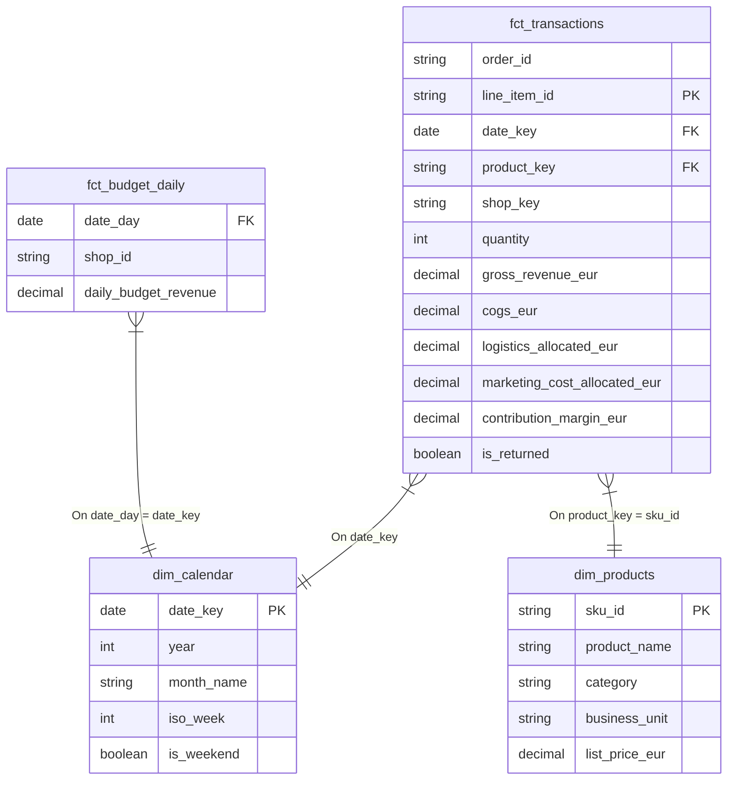

# Handoff to BI: The Vantage Data Model

**From:** Analytics Engineering  
**To:** BI Developer  
**Date:** 2024-02-04  
**Subject:** Star Schema Definition & Join Logic for Vantage Alpin Dashboard

---

## 1. The Data Model (Star Schema)

We have prepared a classic **Kimball Star Schema**. The model is centered around the transactional fact table, supported by clean dimensions.



---

## 2. Table Specifications

### Fact Tables (The "Numbers")

#### `fct_transactions`
*   **Grain:** One row per **Line Item** (Product inside an Order).
*   **Purpose:** Use this for all Actuals (Sales, Profit, Margin).
*   **Keys:**
    *   `date_key` -> Joins to `dim_calendar`.
    *   `product_key` -> Joins to `dim_products.sku_id`.
    *   `shop_key` -> Use as a filter/slicer (DE, AT, CH).
*   **Metrics (All in EUR):**
    *   `gross_revenue_eur`: Price * Qty * Exchange Rate.
    *   `cogs_eur`: Cost * Qty * Exchange Rate.
    *   `marketing_cost_allocated_eur`: Daily Spend allocated by revenue share.
    *   `logistics_allocated_eur`: Shipping/Handling allocated per item.
    *   `contribution_margin_eur`: The bottom line profit (Rev - COGS - Mkt - Logs).

#### `fct_budget_daily`
*   **Grain:** One row per **Day** per **Shop**.
*   **Purpose:** Use this for "Target vs Actual" pacing charts.
*   **Note:** This table does NOT have a Product granularity. You cannot slice Budget by Product Category, only by Shop and Time.

### Dimension Tables (The "Context")

#### `dim_products`
*   **Key:** `sku_id`.
*   **Hierarchies:** `Category` -> `Business Unit` -> `Product Name`.

#### `dim_calendar`
*   **Key:** `date_key`.
*   **Standard Fields:** Use `month_name` and `iso_week` for trending.

---

## 3. Recommended DAX Measures

Please create these base measures to ensure consistent naming conventions.

### Base Metrics
```dax
// Volume
Total Orders = DISTINCTCOUNT(fct_transactions[order_id])
Total Quantity = SUM(fct_transactions[quantity])

// Revenue
Gross Revenue = SUM(fct_transactions[gross_revenue_eur])

// Costs
Total COGS = SUM(fct_transactions[cogs_eur])
Total Marketing = SUM(fct_transactions[marketing_cost_allocated_eur])
Total Logistics = SUM(fct_transactions[logistics_allocated_eur])
```

### Profitability (The "North Star")
```dax
// Contribution Margin 1 (Product Margin)
CM1 = [Gross Revenue] - [Total COGS]
CM1 % = DIVIDE([CM1], [Gross Revenue], 0)

// Contribution Margin 2 (After Mkt & Logs)
CM2 = [Gross Revenue] - [Total COGS] - [Total Marketing] - [Total Logistics]
CM2 % = DIVIDE([CM2], [Gross Revenue], 0)
```

### Pacing (Actual vs Budget)
*Note: Since Budget is at a different grain (Day/Shop) than Transactions (Line Item), you must handle the granularity mismatch if visualizing by Product.*

```dax
// Budget Revenue
Target Revenue = SUM(fct_budget_daily[daily_budget_revenue])

// Variation
Revenue vs Target = [Gross Revenue] - [Target Revenue]
Achievement % = DIVIDE([Gross Revenue], [Target Revenue], 0)
```

---

## 4. Implementation Checks
1.  **Format:** Ensure all currency fields are formatted as `Currency (EUR)` with 2 decimals.
2.  **Date Table:** Mark `dim_calendar` as the official "Date Table" in Power BI to enable Time Intelligence functions.
3.  **Cross-Filtering:** Keep all relationships as **One-to-Many (1:*)** and **Single Direction**. Avoid Bi-Directional filtering unless absolutely necessary.
