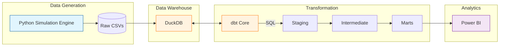
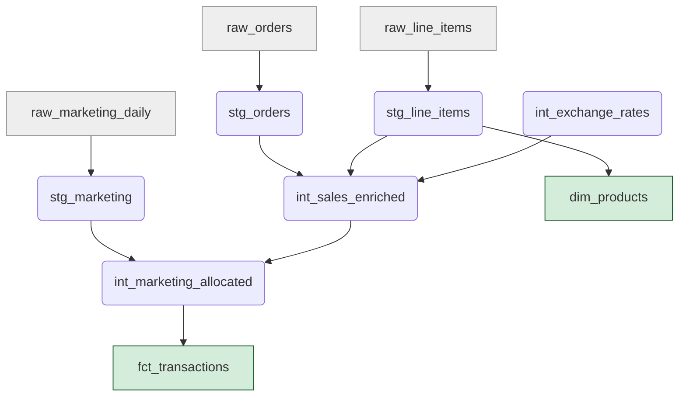
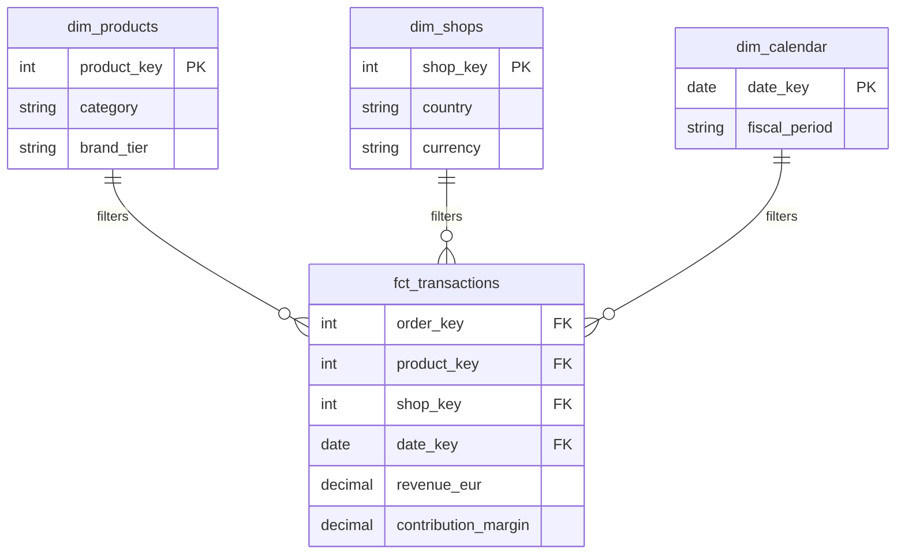

This is the **Documentation & Narrative Strategy** from the perspective of a **Technical Consultant**.
**Role:** Solution Architect / Tech Consultant
**Goal:** Translate code into *capability*.
**Audience:** CTOs, Lead Engineers, and Hiring Managers. They scan for 30 seconds; if hooked, they read for 5 minutes.
**Core Philosophy:** "Show, don't just tell." Use diagrams to prove architectural thinking and crisp text to prove business maturity.
---
# The "Consultant's Pitch": GitHub Documentation Plan
We will structure the `README.md` (and potential `docs/` folder) like a **Client Case Study**. It moves from the Business Problem $\to$ The Solution Architecture $\to$ Technical Deep Dive $\to$ Value Delivered.
## Phase 1: The Narrative Arc (Structure)
Do not start with "How to install." Start with "What this is."
**1. The Executive Summary (Above the Fold)**
* **Headline:** *Vantage Analytics: Full-Stack BI Pipeline Re-Engineering*
* **Sub-headline:** *From Stochastic Data Generation to Star Schema Analytics using Python, DuckDB, dbt, and Power BI.*
* **The "Why":** "This project solves the problem of disconnected financial reporting by establishing a single source of truth for Sales, Margins, and Forecasting across the DACH region."
**2. The Architecture (The "Big Picture")**
* A clean, high-level diagram showing the data flow.
* **Language:** "Modern Data Stack (MDS) principles applied to a local-first architecture."
**3. The Engineering Rigor (The "How")**
* **Data Simulation:** Explain the math (Poisson processes, seasonality).
* **Transformation:** Explain the modeling strategy (Kimball, dbt layers).
* **Quality:** Explain the testing framework (Schema tests, Unit tests).
**4. The Business Value (The "So What?")**
* Showcase the Power BI output.
* Highlight the specific KPIs solved (e.g., "Solved the Currency Normalization challenge").
---
## Phase 2: Visual Assets (Mermaid & Figma)
We will use **Mermaid.js** for structural diagrams (renders natively in GitHub) and **Figma** for high-fidelity concept charts.
### Diagram A: The High-Level Pipeline (Mermaid)
*Purpose: Instant understanding of the stack.*

### Diagram B: The Data Lineage / DAG (Mermaid)
*Purpose: Proves you understand modularity and lineage.*

### Diagram C: The Data Model / ERD (Mermaid)
*Purpose: Proves you know Kimball / Star Schema.*

### Diagram D: The Figma Asset (To be created)
* **Concept:** "The Layered Onion."
* **Visual:** A 3D isometric stack showing:
* **Bottom Layer (Grey):** Python Code / Noise Injection.
* **Middle Layer (Orange):** dbt Logic / Testing Shield.
* **Top Layer (Green):** The Dashboard / KPI Cards.
* *Use this as the "Hero Image" at the very top of the README.*
---
## Phase 3: The Copywriting (High-Quality Language)
Here are snippets of text to use in specific sections to sound like a Senior Consultant.
### On Data Generation
> *"Rather than relying on static dummy data, this project utilizes a custom **stochastic simulation engine**. Modeled on a Non-Homogeneous Poisson Process (NHPP), the generator accounts for weekly seasonality, holiday spikes (Black Friday effects), and category-specific basket affinities. This ensures the resulting analytics reflect real-world volatility rather than mathematical uniformity."*
### On dbt Architecture
> *"The transformation layer adheres to a strict **Staging-Intermediate-Mart** pattern. Complex business logic—specifically the multi-currency normalization and the allocation of daily marketing spend to individual order lines—is decoupled in the Intermediate layer. This ensures the final Marts are purely presentation-ready, optimizing Power BI performance."*
### On Quality Assurance
> *"Data integrity is enforced via **Contract Tests** on the raw layer and **Unit Tests** on the business logic. A specific 'Golden Rule' test asserts that the sum of allocated marketing costs in the Fact table matches the source spend within a €1.00 tolerance, guaranteeing financial reconciliation."*
---
## Phase 4: Repository Organization (The "Clean Room")
A messy repo kills confidence. The Consultant ensures the folder structure tells a story.
```text
/
├── assets/ # Architecture diagrams (Figma exports)
├── data_pipeline/ # The Engineering Core
│ ├── generator/ # Python Logic
│ └── dbt/ # Transformation Logic
├── analytics/ # The Business Core
│ ├── pbix/ # Dashboard files
│ └── queries/ # Validation SQL
├── docs/ # Detailed "Whitepapers"
│ ├── data_dictionary.md
│ └── logic_allocation.md
└── README.md # The Pitch
```
## Summary of the Consultant's Plan
1. **Impress immediately** with a custom Figma Hero Image representing the stack.
2. **Prove architecture** with Mermaid diagrams (Pipeline, Lineage, ERD).
3. **Prove technical depth** by explaining *why* you chose NHPP for data generation and Star Schema for modeling.
4. **Prove business value** by showing the final Power BI output and the problems it solves.
5. **Keep it concise.** Use collapsible `` tags for long code blocks.